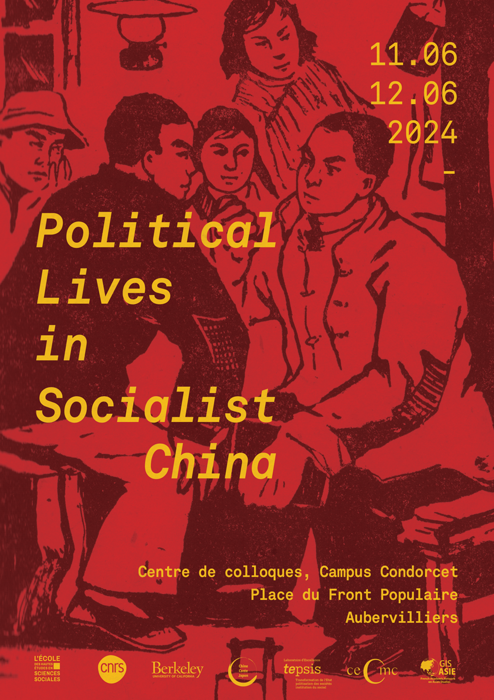

ChinaComx researcher Damian Mandzunowski will present a paper titled **Collective Reading Practices After the Cultural Revolution** at the conference [Political Lives in Socialist China](https://www.ehess.fr/fr/colloque/political-lives-socialist-china) organized by [Isabelle Thireau, CNRS/EHESS, CCJ-CECMC](https://www.ehess.fr/fr/personne/isabelle-thireau) and [Puck Engman, Center for Chinese Studies at UC Berkeley](https://history.berkeley.edu/puck-engman) and held at the EHESS: École des hautes études en sciences sociales in Paris on 10-12 June 2024. Click [here](../assets/images/PoliticalLivesInSocialistChina.pdf) for the program.

His paper abstract:
> Conventional understanding of post-Cultural Revolution China suggests a gradual but steady shift from politics to production. However, did politics truly vanish, or did one form of the political replace another? This paper takes a case study approach, examining a selection of mid-1970s mass-reading campaigns, to inquire how political study continued to shape the daily lives of workers and cadres. The mass phase of the Cultural Revolution, due to the excesses of group readings of confessions and accusations at struggle sessions, rendered texts relevant to virtually everyone. Once it was over by the early-1970s, it gave way again to more systematically organized practices of collective reading akin to those functioning in the PRC since 1949. While study materials swiftly adapted to current political goals, a system of incentives and penalties ensured regular participation. Detailed descriptions from above further facilitated a tightly controlled guidance. State propaganda hence put much effort in utilizing collective reading practices to convey notions of statehood, class struggle, and mass society. At the same time, collective readers ultimately choose their own participation strategies ranging from enthusiastic activism through careful ignorance to blatant disruption. Examining the intertwined relationship between collective reading practices, the resurgence of the state apparatus, and the intra-party struggles over Mao’s succession illustrates how the lived experience of politics retained its significance also within the context of state socialist promotion of production.

